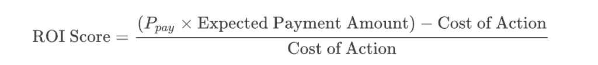

# CredResolve Data Analysis

## Overview
CredResolve is a debt recovery fintech that uses a mix of high-tech (AI Voice Bots, WhatsApp) and high-touch (Human Agents, Field Visits) channels to resolve debts.

## The Business Problem
Using a "Field Visit" (Cost: ₹150) for a customer who would have paid via a simple "WhatsApp Link" (Cost: ₹1) is a waste of money. Conversely, sending only WhatsApp messages to a stubborn defaulter who ignores them is a waste of time.

## The Goal
Build a machine learning engine that analyzes a borrower's interaction history and recommends the optimal next channel (WhatsApp, Voice Bot, Human Call, or Field Visit) to maximize the Return on Action Spend (ROAS).

## Evaluation
For every lead in the test set, the participant must predict the Probability_of_Payment ($P_{pay}$) for each channel. The system will select the channel with the highest ROI score:



**Winning Criteria:** The submission that yields the highest total specific Recovered Amount per Rupee Spent on the unseen test set wins.

## Submission File
For each id in the test set, you must predict a probability (between 0 and 1) for the TARGET variable. The TARGET represents the likelihood that the suggested_action provided in the test dataset will result in a successful payment recovery.

```csv
id, TARGET
25359423,0.95
25359203,0.05
5686585,0.42
11974847,0.10
etc.
```
